# Aprende Haciendo
- Aca vas a poder crear tu primer Programa paso a paso y aprender en el camino ;).

## Que vamos a crear?
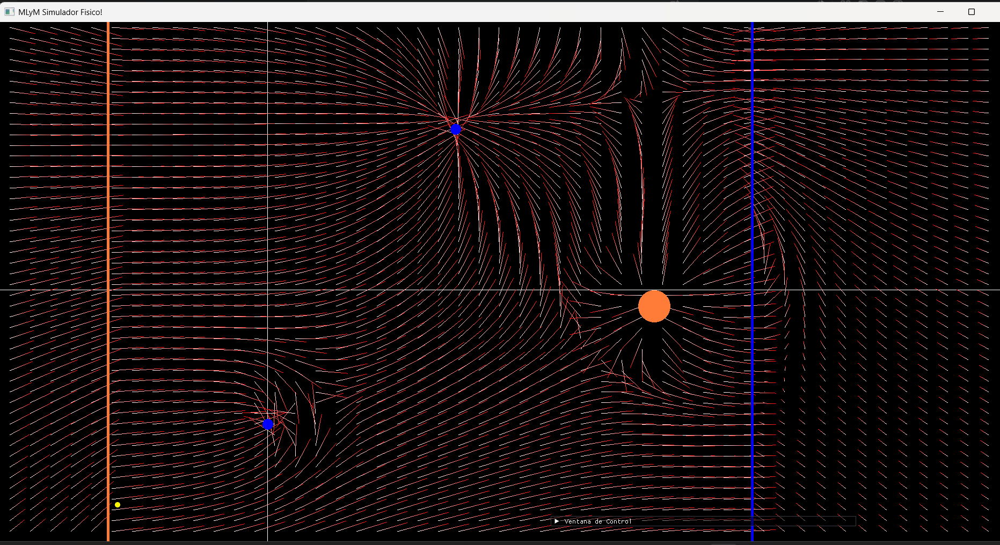
- podemos ver 3 cargas Fijas, Azul (con carga negativa) y Naranja(carga positiva), 2 Planos en los extremos. Y la carga libre (Amarillo), que sera la que sentira las fuerzas y se movera por el sistema.
- Nuestro objetivo es crear el sistema de la imagen paso a paso, y darle a simular para ver como se comporta el sistema.

## Primer paso: Setear los Ejes y variable tiempo
- Lo primero que veras sera la ventana de trabajo donde sucederan las simulaciones.
- Tambien veras la ventana de configuracion. Puedes moverla clikeando y arrastrando o modificar su tamaño. 
- colocar y trabajar sobre un eje de coordenadas siempre es lo recomendable.
- para poner un eje vamos a: colocar eje de coordenadas.
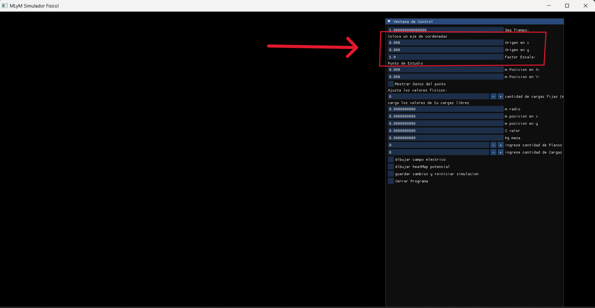
- ingresamos el valor: 500 en ambos ejes y se desplegara la checkbox: dibujar eje cordenado, la clickeamos para setarlo.
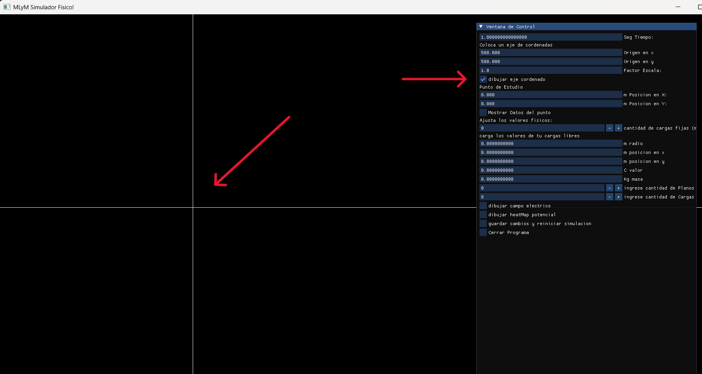
- Vamos a configurar la variable tiempo, la cual le dice al programa con que precision simular los movimientos de la particula libre. Arriba de todo de la ventana confi y seteamos la variable Tiempo de 1 (como estaba por default) a 0.1.
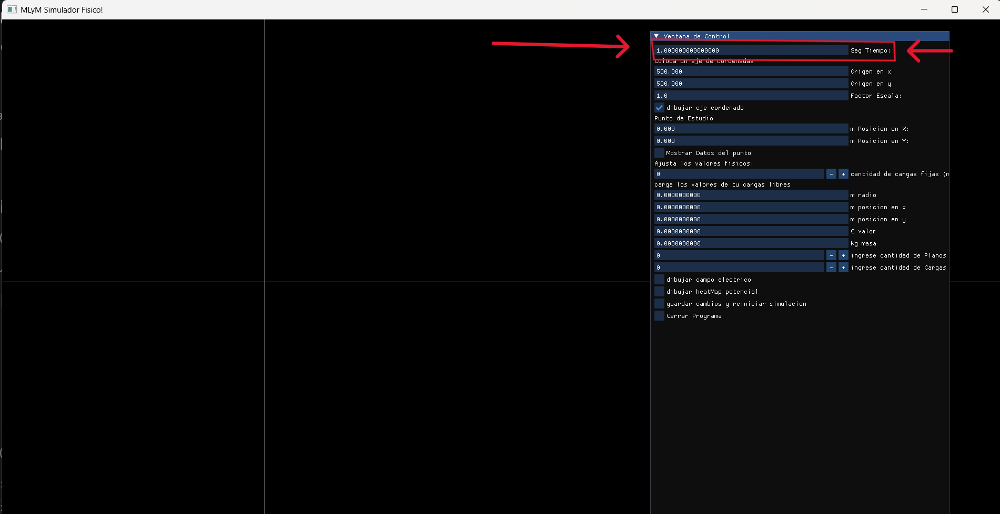

## Ingresar Cargas:
- ahora vamos a ingresar todas nuestras cargas fijas. para eso iremos a:
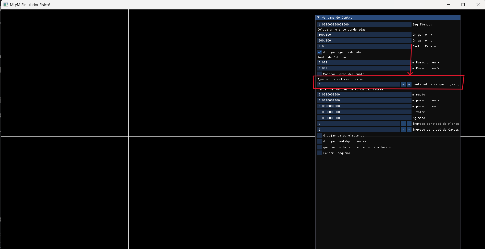
- le damos al simbolo '+' 3 veces para agregar nuestras 3 cargas.
- se desplegara dentro de la ventana de configuracion un menu para ingresar los datos para cada una de tus cargas.
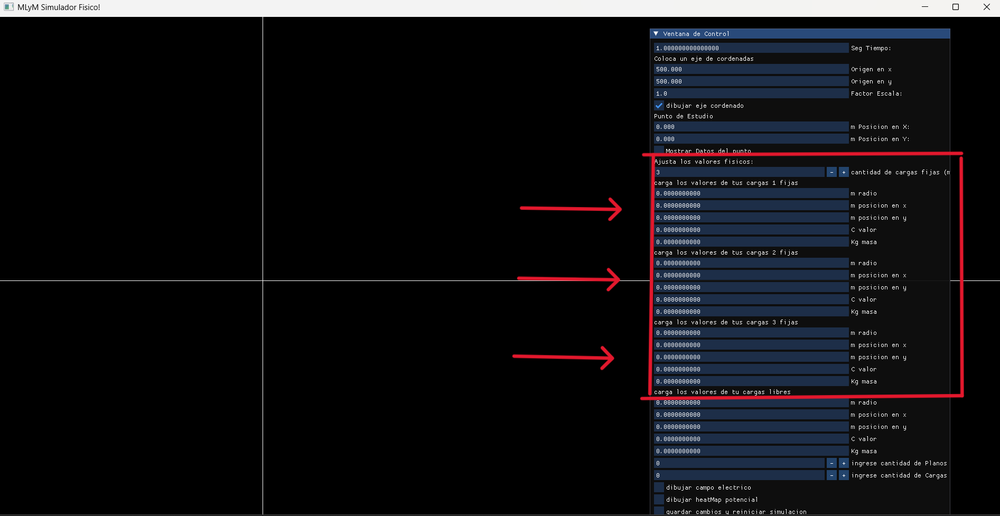
- Para ingresar los datos simplemente seteamos los valores de del menu desplegado.
- Ingresaremos nuestra primera carga. Ingresa los siguientes datos en tu carga numero 1:
- Radio=10.
- Posicion X=0.
- Posicion Y=-250.
- Carga: -0.0003.
- Masa (la dejamos como esta en 0). 
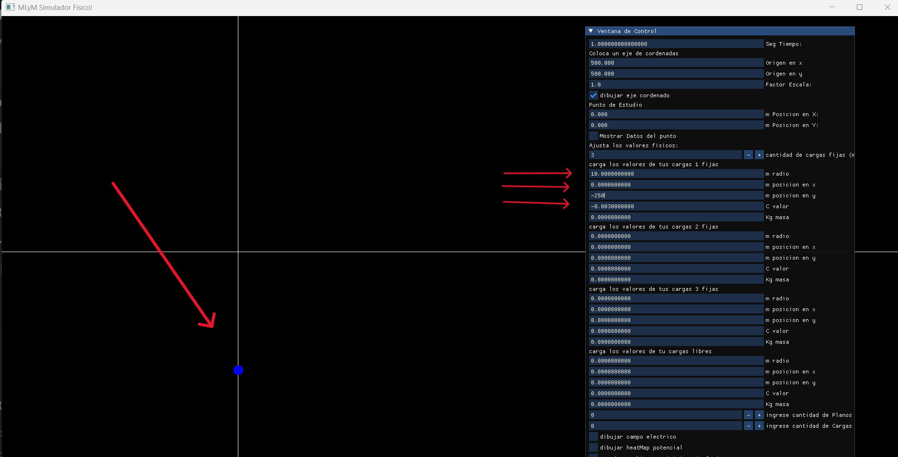
- hacemos lo mismo con las 2 cargas restantes. con los siguientes datos:
- Carga 2:
- Radio=30.
- Posicion X=720.
- Posicion Y=-30.
- Carga: 0.0005.
- Masa (la dejamos como esta en 0). 
-Carga 3:
- Radio=10.
- Posicion X=350.
- Posicion Y=300.
- Carga: -0.0039999997.
- Masa (la dejamos como esta en 0). 
- Con esto ya tenemos gran parte del sistema.
- Podes probar dibujar el campo Electrico y el potencial para ver como se comportan con esta disposicion de cargas

### Ingresamos los PLanos Infinitos
- similar a como hicimos con las cargas, buscamos: Ingrese la cantidad de planos y le damos 2 veces a '+'.
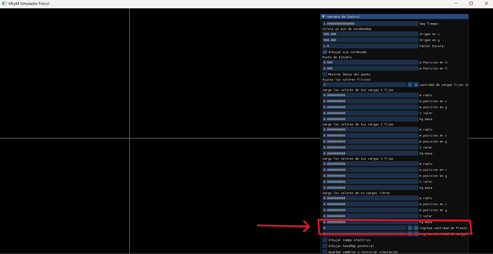
- se desplegara un menu dentro de la ventana, para que podamos ingresar los datos.
- Ingresaremos los siguientes datos:
- Plano 1:
- Posicion X: -300.
- Densidad de Carga: 0.0000000008
- el valor del potencial: 0.
- Plano 2:
- Posicion X: 900.
- Densidad de Carga: -0.0000000008
- el valor del potencial: 0.
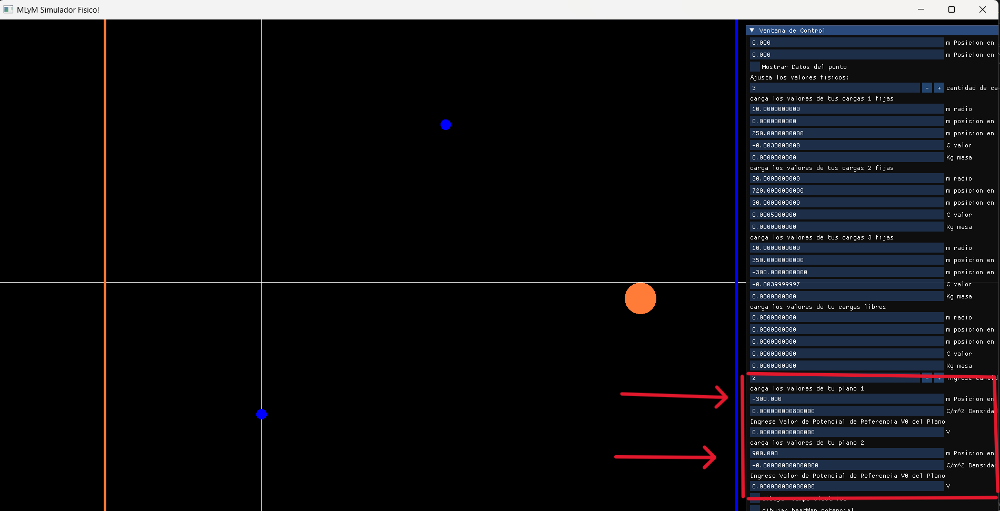
- ya tenemos casi todo el sistema armado, si mostramos el campo electrico deberiamos ver lo mismo que en la primera imagen que tomamos como objetivo para este tutorial

## Ultimo Paso: La Carga Libre.
- Esta es por lejos la mas interesante
- Esta es la carga que sentira las fuerzas Electricas y movera por nuesto sistema.
- El menu de la carga Libre siempre esta desplegado en nuestro menu.
- Ingresaremos los siguientes valores:
- Radio=5.
- Posicion X=-280.
- Posicion Y=-400.
- Carga: 0.004.
- Masa : 1.
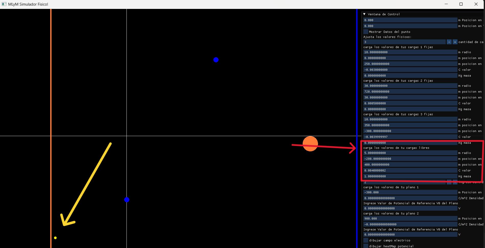

## Simular
- Ahora solo queda darle a guardar Cambios e iniciar simulacion.
- Una vez con la simulacion funcionando nuestra ventana de configuracion que conociamos desaparecera y veremos una nueva, que sera nuestra ventana mientras el programa esta corriendo.
- Alli podras ver datos importantes.
- Si le damos a dibujar vector velocidad y vector Fuerza
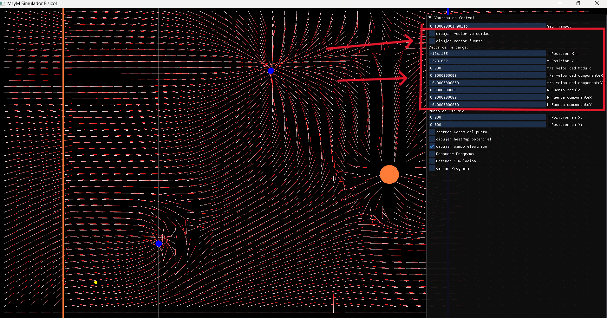
- Veremos como se dibuja sobre nuestra Carga libre estos vectores, ademas de mostrarnos los datos en modulo y componente de los mismos
- Tambien podemos Pausar el Programa cuando querramos, para analizar la situacion mejor en estatico.
- Luego podes cerrar el Programa en Cerrar Programa.
