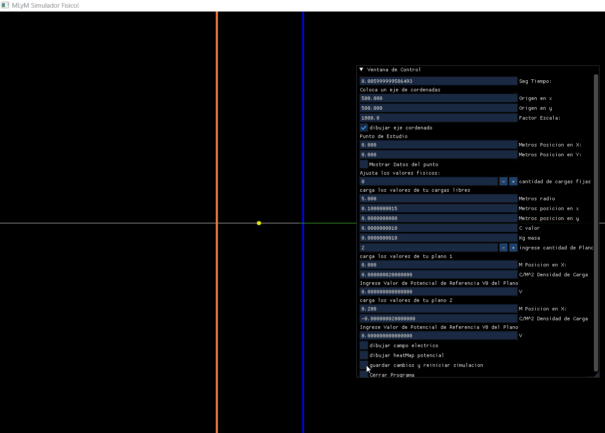
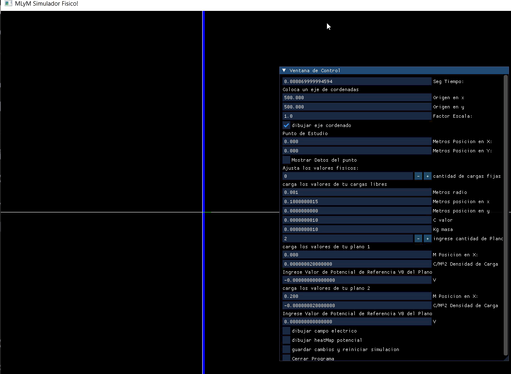

# Usaremos el Programa para ayudarnos a entender y resolver algunos Ejericios

## Problema 1

- En el inciso b específicamente nos piden encontrar las coordenadas donde el campo Eléctrico sobre el eje x se anula.
- En primer lugar ingresamos y dibujamos el eje para trabajar mas ordenados. (Es recomendable siempre trabajar con un eje definido)
- En segundo ingresamos todos los datos en las unidades que el problema nos proporciona, al ser distancias tan pequeñas nos conviene cambiar el factor escala hasta un punto sean apreciables las distancias entre las cargas, por ejemplo factor Escala= 100000.0 . (Es necesario colocar una de las cargas en eje (0,0) para poder escalar de forma correcta y que todo se vea en la pantalla)
- Luego dibujamos el campo Eléctrico.
- Vamos a poder apreciar siguiendo los vectores dibujados que a la derecha de la carga Positiva es muy probable que el campo se haga =0, por cómo se dibujan los vectores en ese punto. Esto nos da una idea visual muy rápida de por dónde van los tiros.

- Con esta información podemos empezar a buscar el punto igualando los componentes del campo y despejando X.
- En esta ocasión nos dispondremos a buscar la distancia X a mano en el programa.
- Probamos coordenadas distintas de X con la función Punto Estudio y ponemos mostrar datos punto estudio.
- Ya tenemos una referencia visual de donde el campo puede anularse, así que probamos valores de X en esa zona
- Haciendo prueba y error encontramos un valor muy cercano a 0 en x=341.412 (recordemos que tenemos el sistema escalado por 10^5, por ende nuestro X real encontrado sería 314x10^(-5))

- chequeamos que la solución es correcta y que las diferencias son despreciables debidas a como la computadora redondea decimales.

- Confirmamos que el campo Dibujado con el programa se condice con el presentado en la solución

## Problema 2

- Tenemos un sistema formado por 3 placas que pueden considerarse infinitas, en problema no especifica valores específicos pero sí los suficientes como para recrear el problema.
- Ingresamos las 3 placas Infinitas, y le asignamos a cada una la relaciones de cargas que da el problema.

- el punto a) nos pregunta por el campo Eléctrico generado por las placas. vamos a tener 4 zonas donde el campo va a ser distinto. Para ayudar con este inciso simplemente vamos a mostrar el campo Eléctrico.

- Elegimos a drede esos valores de densidad de carga respetando lo propuesto por el problema para ver con mayor precisión como los vectores del campo eléctrico cambia entre las distintas zonas.
- el punto b) nos pide averiguar el potencial sobre todo el eje x. Podemos ayudarnos de la función dibujar Heatmap Potencial para poder ver y entender cómo se distribuyen los valores del Potencial

- Adicionalmente podemos usar el Punto Estudio y moverlo por todo el eje x, para averiguar los valores precision de campo Eléctrico y Potencial.

## Problema 3
.png)
- En este Problema tenemos 2 Planos que se pueden considerar Infinitos y una carga Libre que se va a estar moviento. Cargamos todo en el Programa con los datos dados por el problema teniendo en cuenta de convertir las unidades correctamente. También notamos que al ser distancias muy pequeñas, sería recomendable aumentar la precisión del programa cambiando la variable tiempo probamos un valor inicial de 0.01.

- Esto nos aclara en gran medida qué es lo que sucede en el sistema.
- Aun así El Problema nos pide averiguar el valor final de la Velocidad justo antes de impactar con la placa. Afortunadamente nuestro programa detecta las colisiones y guarda las velocidades en el momento del impacto y las imprime por consola.
- Si usamos la Disposición actual que muestro en el gift anterior, la velocidad en el momento es esta, y es Incorrecta.

- Esto se debe a que en ejercicios anteriores ponemos radios grandes para visualizar correctamente las cargas, si queremos datos más precisos vamos a tener que poner un radio muy pequeño, que tienda a 0 como el de una carga puntual y aumentar la precisión del programa disminuyendo la variable tiempo.
- Aun así seguimos teniendo otro Problema, Hay que tener en cuenta que estamos trabajando con planos que consideramos infinitos que en la teoría crean un campo constante en ambas direcciones. Cuando Escalamos el Programa y las placas se alejan, el campo sigue siendo constante sea cual sea la distancia entre ellas, lo que no representa fielmente la realidad, ya que si alejamos el campo de un plano no infinito disminuye, y si las acercamos el campo es mucho más fuerte. Al no poder representar eso de forma correcta, en la práctica del programa cuando cambiamos el factor Escala, estamos agregando artificialmente distancia entre ellas, haciendo que la carga que antes recorría una distancia con cierto campo Eléctrico, Ahora recorre una distancia mucho mayor sometida al MISMO campo. Por ende Encontramos una limitación Teoría que no podemos representar en el Programa. Escalar en este Problema solo nos sirve para visualizar correctamente el sistema y como se mueve.
- Aun así esto no nos detiene y aun así podemos encontrar la solución, ya que escalar no es un paso necesario, solo sirve para visualizar correctamente las cosas.
- Si NO escalamos el sistema, utilizamos un radio que represente mas a una carga puntual y aumentamos las presiones en gran medida llegando al resultado correcto.
- Entonces Desescalar el programa y lo asignamos en escala 1, cambiamos a un radio más pequeño como 0.001 y aumentamos las presicion, colocando tiempo en 0.00001
-

- La solución se acerca mucho a la dada en el ejercicio, las diferencias se dan en gran medida por el tamaño del radio.