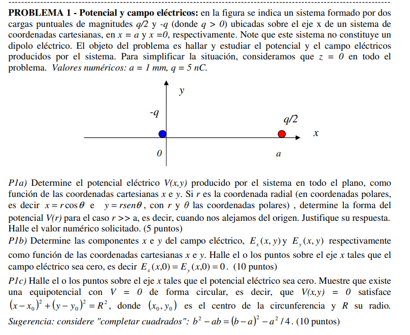
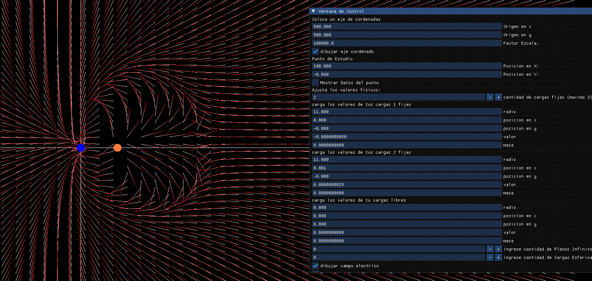
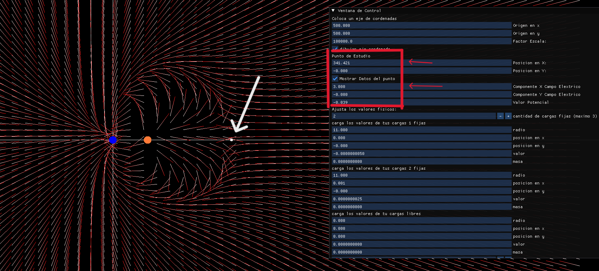
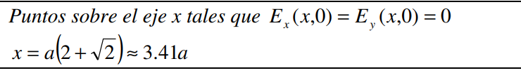

# Usaremos el Programa para ayudarnos a entender y resolver algunos Ejericios

## Problema 1

- En el inciso b especificamente nos piden encontrar las cordenadas donde el campo Electrico sobre el eje x se anula.
- En primer lugar ingresamos y dibujamos el eje para trabajar mas ordenados. (Es recomedable siempre trabajar con un eje definido)
- En seguno ingresamos todos los datos en las unidades que el problema nos proporciona, al ser distancias tan pequeñas nos conviene cambiar el factor escala hasta un punto sean apreciables las distancias entre las cargas, por ejemplo factorEscala= 100000.0 . (Es necesario colocar una de las cargas en eje (0,0) para poder escalar de forma correcta y que todo se vea en la pantalla)
- Luego dibujamos el campo Electrico.
- vamos a poder apreciar siguiendo los vectores dibujados que a la derecha de la carga Positiva es muy probable que el campo se haga =0, por como se dibujaron los vectores en ese punto. Esto nos da una idea visual muy rapida de por donde van los tiros.

- Con esta informacion podemos empezar a buscar el punto igualando los compontentes del campo y despejando X.
- En esta ocacion nos dispondremos a buscar la distancia X a mano en el programa.
- Probamos cordenadas distitnas de X con la funcion Punto Estudio y ponemos mostrar datos punto estudio.
- Ya tenemos una referencia visual de donde el campo puede anularse, asi que probamos valors de X en esa zona
- Haciendo prueba y error encontramos un valor muy cercano a 0 en x=341.412 (recordemos que tenemos el sistema escalado por 10^5, por ende nuestro X real encontrado seria 314x10^(-5))

- chequeamos que la solucion es corrercta y que las diferencias son despreciables debidas a como la computadora redondea decimales.
