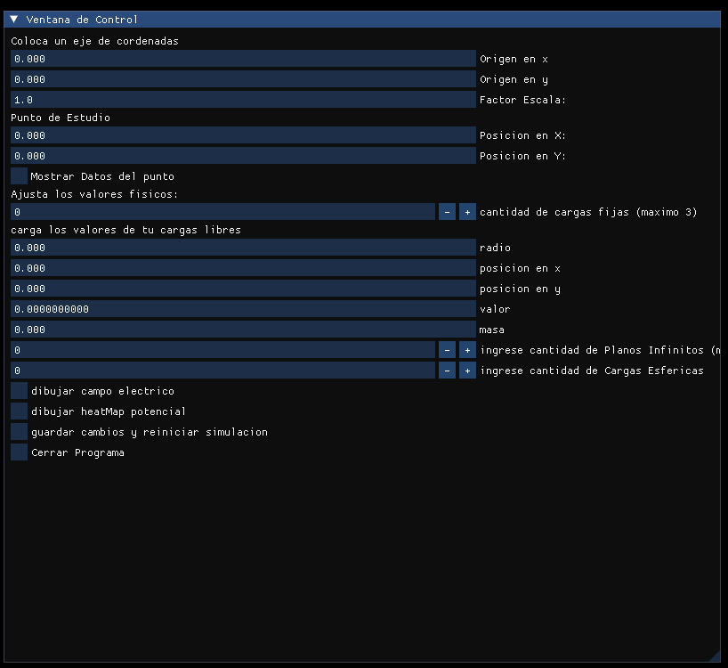
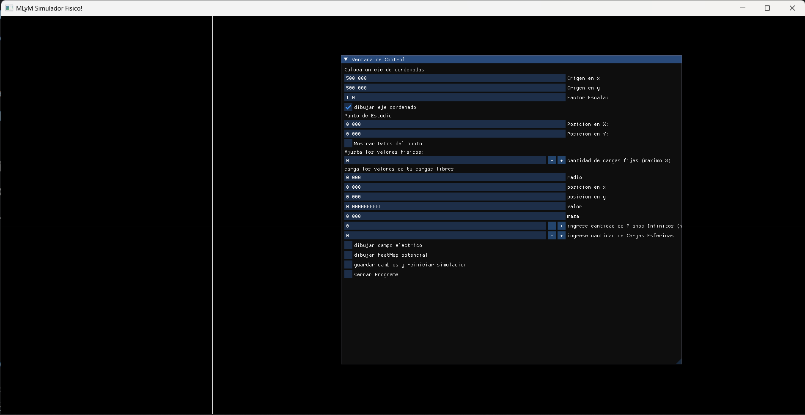
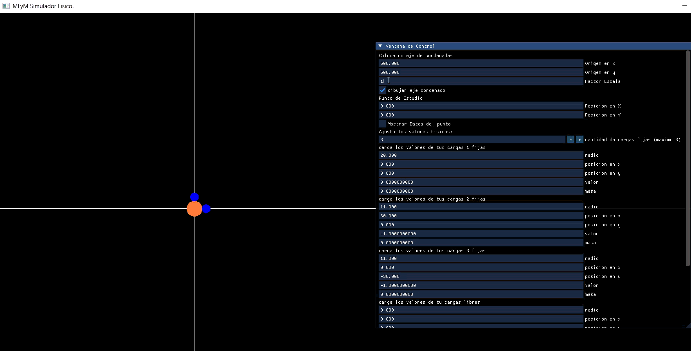
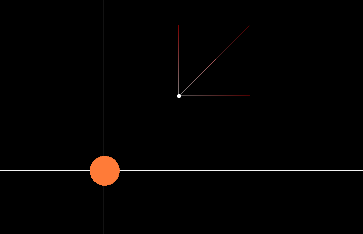
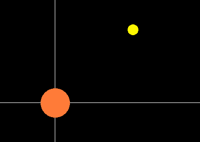
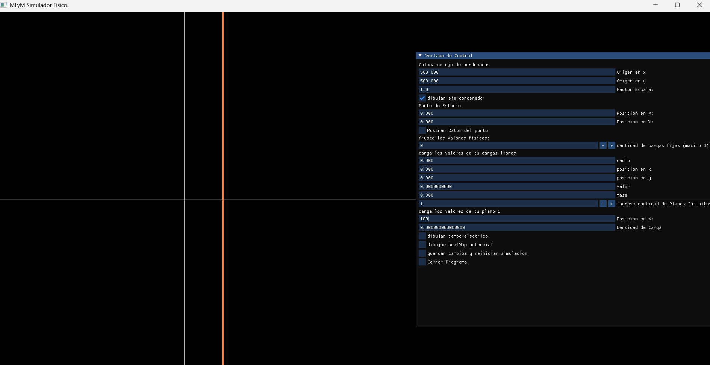
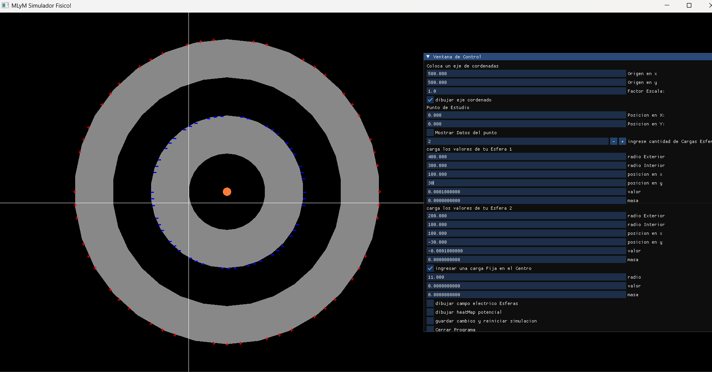
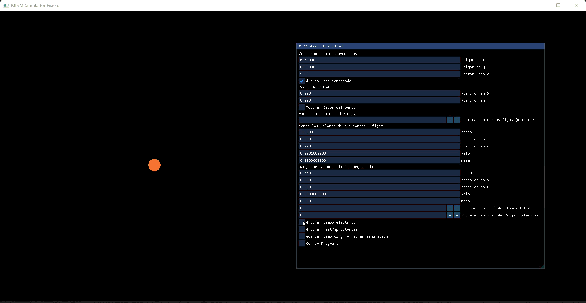
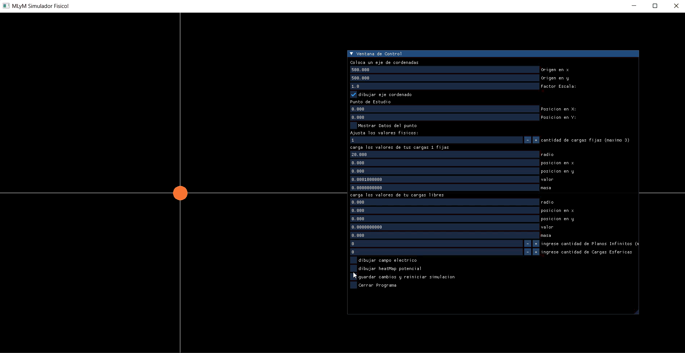
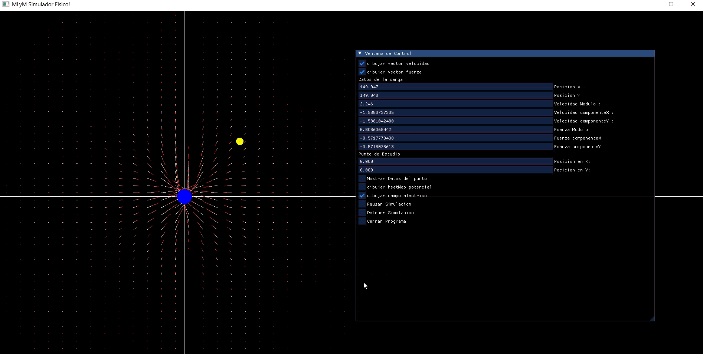

# GUIA
## Programa Detenido
- nos aparecera la ventana de control o menu el cual nos permitira trabajar con el programa, podemos agrandar y mover el menu a placer, haciendo clik en el y arrastrando.

- lo primero que vemos es que podemos cambiar el valor tiempo con el que se ejecuta los calculos, este valor representa la presicion con la que se van a realizar los movimientos. Un valor alto sera poco preciso y un valor muy bajo sera muy preciso. (poner un valor muy bajo hara al programa muy preciso en las simulaciones de movimiento pero tambien, el movimiento sera muy lento.)
- primero tenemos el eje de cordenadas. podemos setear el origen en cualquier lado de la pantalla ingresando las cordenadas, en principio el mapa tiene 1900 de ancho y 1000 de alto. donde x crece hacia la derecha e Y hacia abajo.

- el factor escala nos permite escalar el sistema para poder ver con presicion, cuando las distacias son muy pequeñas.

### Punto estudio
- Punto estudio permite calcular el campo electrico en componentes y mostrarlo en forma de vetores, ademas de calcular el Potencial, colocamos sus cordenadas respeco al eje que hayamos elegido.
- clikear mostrar datos, mostrara un punto en las cordenadas elegidas los vectores y los datos numericos, !importante, para que se muestre correctamente, previamente se debera haber iniciado la simulacion o mostrado el campo electrico de las cargas.

- Ingresar cantidad de cargas Fijas: estas no se mueven a lo largo de la simulacion, y cargamos sus datos respetando el eje de cordenadas. Represetadas con color azul o naranja segun el signo de su carga
- Ingresar Datos carga Libre: esta carga es la sentira las fuerzas generadas por el campo electrico y se movera respecto a ellas. Representada siempre con un color amarillo independientemente de su carga.

- Ingresar Plano Infinito: te permitira ingresar su cordenada en X segun el eje,(los planos solo pueden moverse sobre el eje x) y su densidad superficial de carga.

### Ingresar Conductores Esfericos
- el objetivo de este apartado es mostrar la induccion de conductores y cargas centradas en el eje de simetria.
- al aumentar la cantidad de cargas Conductoras cambia la ventana de configuracion
- mientras tengas cargas conductoras No podras ingresar cargas libres, y solo se permitira una carga fija ligada a los conductores
- las cargas conductoras y la carga fija ligada comparten todas la misma posicion. (cambair una cambia las demas)
- se cargan valores normalmente y segun la carga del conductor, veras las cargas colocarce en la superficie del mismo.

- Ingresar carga fija en el centro: colocara una carga que comparte posicion y puede inducir carga en los conductores.
### dibujar campo Electrico:
- disponible en todo momento que permite visualizar el campo Electrico con vectores: los cuales indican su sentido con el color rojo. el blanco es el  origen.

- en el caso de estar trabajando con conductores el boton dibujar campo Electrico, tambien actualizara y mostrara la induccion de cargas generadas por el sistema.
.gif)
### dibujar HeatMap Potencial Electrico:
- calcula el potencial electrio en todo el mapa solo para las cargas Fijas no conductoras, representa con colores mas fuertes los valores altos de potenial

### guardar cambios e iniciar simulacion
- cuando tenemos una carga libre, se comensara a calcular las fuerzas y su movimiento. te lleva a la ventana [programa Ejecutandose](#venta-programa-ejecutandose)

## Venta Programa Ejecutandose
- Botones dibujar vector fuerza y velocidad: muestran en tiempo real los vectores de fuerza y velocidad que siente la particula libre
- Datos particula libre: muestra todos los datos de posicion,fuerza y velocidad en modulo
- tambien permite ingresar un punto de estudio mientras el programa se ejecuta [ver punto estudio](#punto-estudio)
- dibuajar campo Electrico y potencial Electrico [Campo Electrico](#dibujar-campo-electrico) [Potencial](#dibujar-heatmap-potencial-electrico)
- Pausar Y Reanudar Programa
- Detener Simulacion: retorna la carga Libre a su punto incial y te devuelve a la ventana Programa Detenido [ver Programa Detendio](#programa-detendio)
- El programa se detendra Automaticamente cuadno la particula Libre colisione, ya sea con una carga fija o un Plano Ifinito.
