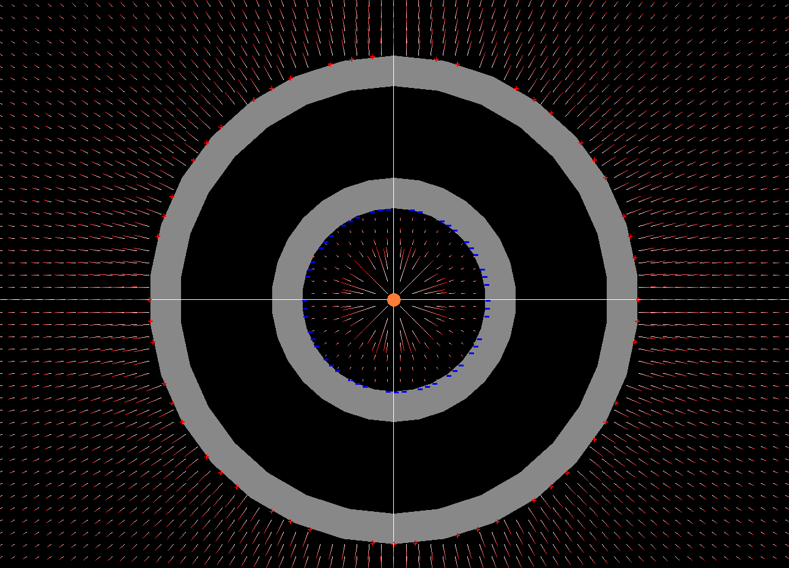
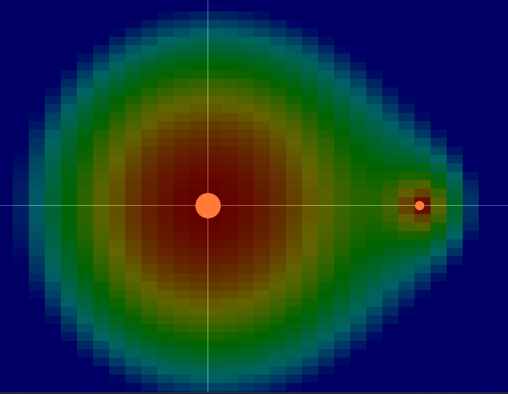
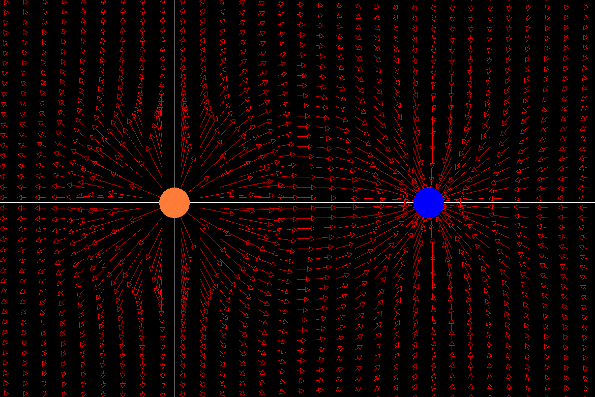
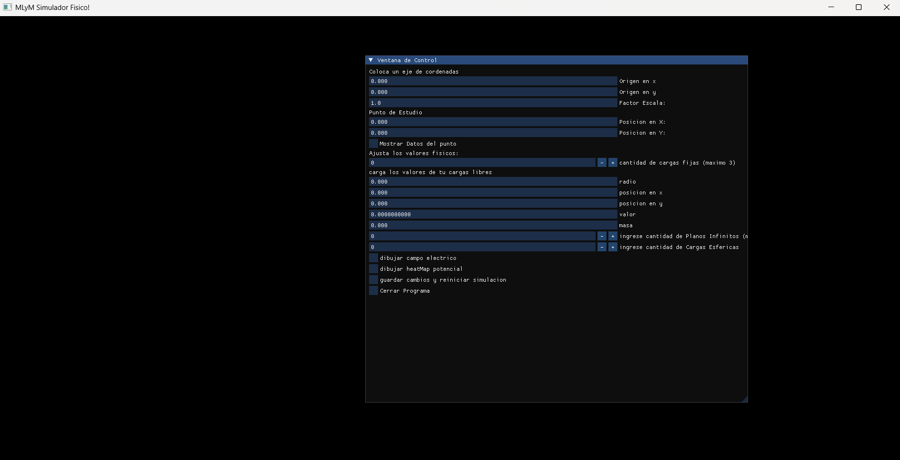

# Simulador Fisico Electroestatica y Electrodinamica en C++ #

# Que es esto?
- Un simulador Visual de Campos Electricos, Potencial Electrico, sobre cargas, planos y Esferas Conductoras
## Que hace?
- Permite crear simulaciones en un entorno 2D con cargas puntuales,planos y esferas.
- Visualizar el Campo ELectrico como vectores.
- Visualizar el Pontecial Electrico .
- Simular el movimiento de una carga libre sometido a distintos campos Electricos.
- Simular y visualizar el comportamiento de las cargas inducidas en conductores.
## Caracteristicas Principales
- Representacion de campo electrico en forma de campo vectorial y potencial electrico en forma de mapa de calor, de cargas fijas puntuales, planos Infinitos y Conductores Esfericos
- Simulacion de una carga Libre sometida a campos Electricos generados por otras cargas Y planos Infinitos.
- Calcula y Dibuja el vector velocidad y fuerza que siente la particula Libre en modulo y compontentes.
- Calcula y Dibuja el campo electrico y potencial en un punto fijo.
- Representa la induccion de carga de forma intuitiva en conductores Esfericos huecos con una carga fija.
- Permite colocar un eje coordenado.
- Permite escalar el sistema para representar distancias muy pequeñas.

- Induccion de Cargas en Conductores Esfericos Huecos y su Campo Electrico.

- Mapa a color del Potencial de 2 cargas.

- Campo Electrico Generado por 2 Cargas de signo opuesto.

# USO
## Estudiantes
- Visualización clara: Esta Herramienta esta orientada a visualizar de forma simple conceptos dificiles de ver o imaginar por que no son cosas que nos encontremos dia a dia.
- Puente teoría-práctica: Facilita llevar a la realidad los sistemas complejos que aparecen estáticos en los libros de texto.
- Versatilidad de estudio: podes usarlo para resolver y comprender problemas de guias o parciales dados en las materias, hasta "JUGAR" con la herramienta y aprender mientras combinas y moves las cargas a placer.
- Control total: haciendo que puedas cambiar un monton de variables. Te permite realizar la simulacion tan lenta y precisa tanto como quieras.
- Laboratorio de "Qué pasa si...": te Permite resolver esas dudas que pondrian de mal Humor a cualquier profesor como: que pasa si la carga es 0.0001 mayor, o si se invierte la polaridad, o si la muevo 0.01m mas arriba o mas cerca.
## Profesores
- Dinámica de clase: permite mostrar campos eléctricos y potenciales de forma viva y fluida durante la clase, manteniendo la atención de los alumnos.
- Llamativo y rapido: para poder retener la atencion de los alumnos. Saliendo de aburridas y escasas imagenes en libros o presentaciones.
- Eficiencia didáctica: Facilita hacer cambios rapidos y mostrar Resultados. Contrasta con lo estatico de un imagen en una presentacion o con lo lento de dibujar el campo electrico de una carga a mano
- Explicaciones complejas simplificadas: Muestra de forma visual la Induccion de carga en conductores, facilitando su explicacion.
- Análisis cuantitativo (Punto de Estudio): La Herramienta cuenta con Punto Estudio, que te permite dibujar y calcular las componentes del vector, modulo y el valor del potencial electrico en un punto exacto.

# Crea tu Primera Simulacion.
- si queres arrancar por lo grande y aprender a usar esta Herramienta para crear cosas como las imagenes que estan mas arriba visita [Aprender haciendo](/APRENDER_HACIENDO).

# Tutoriales
## Basico
- Lo primero que debrias hacer es aprender las cosas basicas.
- Si te gusta Aprender haciendo y queres crear tu primera simulacion visita [Aprender haciendo](/APRENDER_HACIENDO).
- Si te gusta leer que hace cada cosa visita [Tutorial Basico](/TUTORIAL.md) para un tutorial basico o [Guia](/GUIA.md) para mayor profundidad.
## Resolviendo Ejericios
- si queres Aprender mientras resolvermos ejercicios reales paso a paso visita [Resolviendo Ejericios](/EJERCICIOS.md)

# Descargas
## Descargar ultima version
- [ir a descargas](https://github.com/Costabile1/SimuladorFisico/releases/latest)
- [Descargar Ultima Versión para Windows ](https://github.com/Costabile1/SimuladorFisico/releases/latest/download/MLyMSFv2.1.1_windows.zip)
- [Descargar Ultima Version para MACos](https://github.com/Costabile1/SimuladorFisico/releases/latest/download/MLyMSFv2.1.1_macOS.zip)
## Como instalarme?
- installa el zip MLyMSimuladorFisicovx.x.x.zip 
- haz cli en el ejecutable sfml-simulador_fisico-app.exe
- se arbira una interfaz y lo primer que deberias ver es:

- Instrucciones para macOS:
- Permisos: Abrir la terminal en la carpeta y ejecutar: chmod +x simulador_mac.
- Primer Inicio: No hacer doble click. Hacer Click Derecho -> Abrir. Cuando aparezca el cartel de "Desarrollador no identificado", darle a Abrir de todos modos.
- si llegaste aca, lo intalaste y ejecutaste correctamente y deberias ir [TUTORIAL](#tutoriales)
- O podes ir a ver [Ejemplos de como utilizamos este programa para entender y solucionar ejercicios reales](/EJERICICIOS.md).

